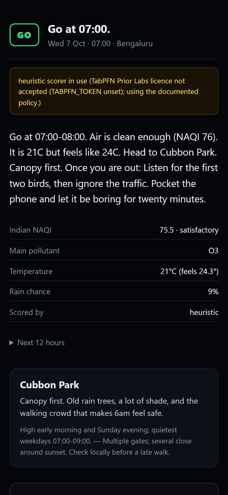

# Baahar · बाहर

> **The screen is the shortest part of the walk.**

Baahar finds Bengaluru's **next safe outdoor hour** from air quality, heat and
rain — speaks a ~30-second park briefing written by an open model — and then
**turns the screen off** so you actually go outside.

Built for the [DEV Hacktoberfest Open-Source AI Challenge, Week 1: Touch Grass](https://dev.to/challenges/hacktoberfest-week1-2026-10-05).



---

## Why this exists

It is 2am and you are building something. The weather app says 38°C, one map
app says the air is fine, another says stay inside, and you have just spent
fifteen minutes resolving a question that should take twenty seconds. Then you
put the phone away and do not leave, because the decision itself was the
screen time.

Baahar collapses that into: **read or hear 30 seconds → pocket the phone →
walk.**

It is deliberately *not* a social app, a tracker, or a feed. It has no streak
counter and nothing to come back to. The success metric is you leaving.

---

## What it actually does

1. Pulls **hourly weather + air-quality signals** for Bengaluru from
   [Open-Meteo](https://open-meteo.com/) (no API key, no signup, no card).
2. Converts those pollutant concentrations into **Indian NAQI** using the CPCB
   sub-index breakpoints — *not* a US AQI number wearing an Indian label.
3. Scores the next hours **GO / WAIT / SKIP** with a tabular model
   ([TabPFN](https://priorlabs.ai/)) on those signals, falling back to a
   documented heuristic when the heavy ML extra isn't installed.
4. Generates a **≤120-word park briefing** with an open model
   (Gemma via [Google AI Studio](https://aistudio.google.com/)), optionally
   fine-tuned on Indian outdoor-briefing style via hosted
   [Tinker](https://tinker.ai).
5. Optionally speaks it aloud, then drops into **Pocket Mode**: near-black
   screen, one line of text, a walk timer. No feeds, no badges, no notifications.

If the air is bad or it is genuinely too hot, Baahar says **SKIP** and means it.
It will not cheer you into bad air.

---

## Quickstart (under 5 minutes)

Requires [Python 3.12+](https://www.python.org/downloads/). Nothing else — no
Node, no Docker, no account, **no credit card**.

```bash
git clone https://github.com/Vedant817/baahar.git
cd baahar

# Option A — uv (fastest)
uv sync --group dev
uv run baahar brief --city Bengaluru          # live Open-Meteo, offline LLM template

# Option B — plain pip
python -m venv .venv && . .venv\Scripts\activate   # Windows
python -m pip install -e .
python -m baahar brief --city Bengaluru
```

That command prints a 12-hour GO/WAIT/SKIP table and a real briefing from live
forecast data. **No API keys are needed** — without a `GEMINI_API_KEY`, Baahar
uses a deterministic local briefing writer, and everything still works.

Now try it with a real open model:

```bash
cp .env.example .env      # then put your free Google AI Studio key in .env
uv run baahar brief --city Bengaluru --model gemma
```

Open the web UI — this is the part that matters:

```bash
uv run baahar serve         # http://127.0.0.1:8000
```


Regenerate the screenshots yourself, with a layout audit that fails on console
errors or horizontal overflow:

```bash
uv run baahar serve &
node scripts/ui_check.mjs --out docs/media
```

| | |
|---|---|
| **Try the CLI** | `uv run baahar brief --city Bengaluru` |
| **Try Pocket Mode** | `uv run baahar serve`, then tap "Pocket the phone" |
| **Record a walk** | `uv run baahar journal --outcome went --note "..."` |

## The three commands

```bash
uv run baahar brief      # decision, hour table, briefing, Pocket Mode payload
uv run baahar serve      # the web app -- two screens and a clock
uv run baahar journal    # after the walk: three taps, one line, markdown out
```

`journal` is the one most people will not expect. It asks what actually
happened, counts how many times you reached for the phone, and prints markdown
ready to paste into a write-up. Local only: a JSONL file or `localStorage`, no
account, no sync. A journal about where you walk is exactly the data this
project should not be collecting anywhere.

### Add the TabPFN tabular model (optional)

TabPFN pulls PyTorch (~2.5 GB), so it lives in a separate dependency group — the
5-minute quickstart stays honest and the disk-frugal constraint stays respected.
Install it only if you want the learned scorer:

```bash
uv sync --group dev --group ml
uv run baahar score --city Bengaluru --scorer tabpfn
```

Baahar tells you which scorer produced every decision, and the heuristic path is
a first-class fallback rather than a stub.

---

## Deadline & provenance

This repo was started on **6 October 2026**, inside the challenge window that
opened 5 October 2026.

| Event | PDT | IST (UTC+5:30) |
|---|---|---|
| Challenge opens | Oct 5, 2026 | Oct 5 evening / Oct 6 early IST |
| **Submissions due** | **Oct 11, 2026 23:59** | **Oct 12, 2026 12:29** |
| Feature freeze | — | Oct 11, 2026 18:00 |
| Write-up lock | — | Oct 12, 2026 10:00 IST |

PDT is UTC−7, so Oct 11 23:59 PDT = Oct 12 06:59 UTC = Oct 12 12:29 IST.

---

## Architecture

```
                    Baahar CLI  ·  Baahar Web (Pocket Mode)
                                  │
                          ┌───────▼────────┐
                          │  orchestrator  │   brief / score
                          └───────┬────────┘
            ┌─────────────────────┼─────────────────────┐
            ▼                     ▼                     ▼
   ┌────────────────┐   ┌──────────────────┐   ┌──────────────────┐
   │ weather.py     │   │ air.py           │   │ score.py         │
   │ Open-Meteo     │   │ Open-Meteo AQ +   │   │ TabPFN  ──or──▶  │
   │ forecast       │   │ CPCB Indian NAQI │   │ heuristic        │
   └────────┬───────┘   └────────┬─────────┘   └────────┬─────────┘
            └─────────────────────┼──────────────────────┘
                              ▼
                   ┌──────────────────────┐
                   │ brief.py             │  Gemma  ──or──▶  Tinker FT
                   │ ≤120 words + caveats │  (optional ElevenLabs voice)
                   └──────────┬───────────┘
                              ▼
                       Pocket Mode
```

Full module-by-module detail: [`docs/ARCHITECTURE.md`](docs/ARCHITECTURE.md).
Decision records: [`docs/adr/`](docs/adr/).

---

## Why open matters here

- **The tabular decision is inspectable.** "Is it safe to walk?" is a
  classification over six public numeric signals. TabPFN fits it from a public
  CSV, and Baahar publishes the confusion matrix — including how often it
  wrongly says *GO* on a day that should have been *SKIP*. A black-box
  "wellness score" could not show you that number, and that number is the whole
  safety argument.
- **Fine-tune and swap.** The briefing model is an interchangeable component.
  A hosted Tinker LoRA on Indian outdoor language, plain Gemma, or a locally
  served open weight — the product does not change. No vendor lock-in is baked
  into the pitch.
- **Cost.** Open-Meteo is keyless. Gemma's free tier needs no card. TabPFN is a
  free research library. The whole demo runs on a laptop with no paid account,
  which is the only reason a solo first-time builder could ship it in five days.
- **Privacy by default.** Location stays at city granularity. There is no GPS
  trail, no background tracking, no account. Baahar cannot follow you, so it
  does not try.
- **Open used to *reduce* screen time.** The interesting engineering problem
  was not "how do we add another surface" — it was "how little screen can this
  survive on." That constraint is only worth meeting with models you can run
  small and cheap.

---

## Honest evals

Every number in [`eval/RESULTS.md`](eval/RESULTS.md) comes from a real run, and
every run's raw output is committed under [`eval/raw/`](eval/raw/) so it can be
re-checked. If something was not measured, `RESULTS.md` says `SKIPPED` and why.

The headline metric is deliberately not accuracy. It is
**`skip_as_go_rate`** — the fraction of genuinely hazardous hours that Baahar
told you to go walk in. A go/no-go classifier that is 94% accurate but sends you
out on the three worst air days of the quarter is worse than useless.

There is a documented failure section too. It is not optional; a benchmark with
no failures listed is a benchmark that was not looked at.

---

## Field test

[`docs/FIELD_TEST.md`](docs/FIELD_TEST.md) holds the checklist for a real
Bengaluru park walk and, separately, the honest record of what actually happened
once a human did it. **The walk is performed by a human; the results are never
invented by the agent.** If it has not happened yet, the doc says so.

---

## What Baahar is not

- **Not a medical device.** Informational outdoor planning only.
- **Not a replacement for the CPCB official advisory.** It reads public
  forecast data, not the official monitoring network, and it will say when it
  is working from a fallback.
- **Not a tracker.** No GPS history, ever.
- **Not a wellness score.** It will refuse to give you a green light in
  conditions that do not warrant one.

---

## Layout

```
baahar/
  src/baahar/
    config.py      settings + .env loading, offline switch
    naqi.py        CPCB Indian NAQI from pollutant concentrations
    weather.py     Open-Meteo forecast client (+ fixture fallback)
    air.py         Open-Meteo air quality (+ optional WAQI stations)
    parks.py       curated Bengaluru parks
    features.py    tabular features for the go/no-go model
    score.py       TabPFN scorer + documented heuristic fallback
    brief.py       Gemma / Tinker / offline briefing writers
    pocket.py      Pocket Mode state + copy
    app.py         FastAPI: /api/brief, /api/score, static UI
    cli.py         Typer CLI
  data/
    parks_blr.json
    samples/       recorded real API responses (offline mode + tests)
    eval/          briefing cases, labelled go/no-go rows
  scripts/         feature build, eval runners
  eval/            RESULTS.md + raw/ run artifacts
  docs/            ADRs, architecture, field test, human-only steps
  post.md          DEV submission draft
```

---

## Data & attribution

| Source | Use | Licence / credit |
|---|---|---|
| [Open-Meteo](https://open-meteo.com/) | Hourly forecast + air-quality forecast | Free non-commercial; © Open-Meteo, CC BY 4.0 attribution |
| CPCB | Indian NAQI sub-index breakpoints methodology | Central Pollution Control Board |
| OpenStreetMap | Park extents and footpaths, curated by hand | © OpenStreetMap contributors, ODbL 1.0 |
| Bengaluru CPCB station data via [OpenCity](https://data.opencity.in/dataset/bengaluru-hourly-air-quality-reports) | Historical rows for go/no-go train/eval | CPCB data via OpenCity |

More detail, including re-verification dates: [`docs/SOURCES.md`](docs/SOURCES.md).

---

## License

MIT — see [`LICENSE`](LICENSE).

Built by [Vedant Mahajan](https://github.com/Vedant817) as a first-time open
source project. Contributions welcome.