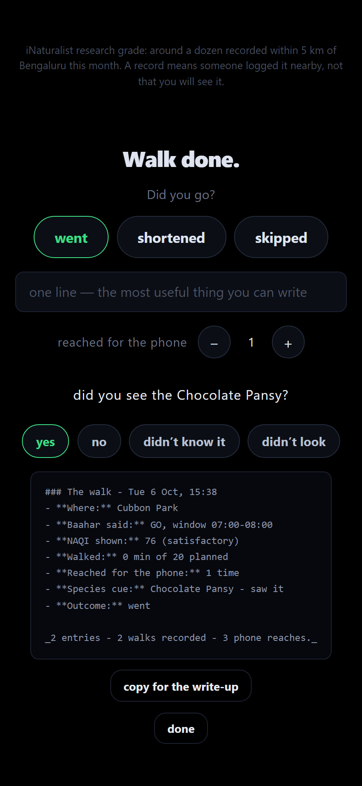

<!--
┌──────────────────────────────────────────────────────────────────────────┐
│  DEV POST DRAFT — Baahar · Hacktoberfest Week 1: Touch Grass              │
│                                                                          │
│  This file is a draft written to be EDITED, not defended.                │
│                                                                          │
│  Before publishing:                                                      │
│    1. Section 7 has one optional marker: replace it with the walk         │
│       results, or delete the comment. The paragraph under it already says  │
│       the walk has not happened, so it ships honestly as-is.              │
│    2. Run the field test (docs/FIELD_TEST.md) to fill section 7.         │
│    3. Re-check the prize categories in section 8 against what ACTUALLY ran.│
│    4. Rewrite the opening in your own voice. It is the weakest part of    │
│       this file because it is the most generic.                          │
│                                                                          │
│  Numbers come from eval/RESULTS.md and eval/raw/. Do not retype a figure  │
│  that is not in there.                                                   │
└──────────────────────────────────────────────────────────────────────────┘
-->

# Baahar (बाहर): I built an agent whose success metric is me leaving the house

**Touch Grass · Week 1 · Open-source AI that gets you off the screen**


Every AI tool I use is trying to keep me at my desk. Mine is the first one I've
built that is explicitly trying to get me out of it.

It is 2am and I am building something. I open a weather app: 38°C. I open a map
app: the air is fine here. I open a third: stay inside. Fifteen minutes later I
have resolved a question that should have taken twenty seconds, and I have not
left the desk.

**Fifteen minutes is the problem. Not the weather app.**

So I built **Baahar** (बाहर — *outside*). It finds Bengaluru's **next safe outdoor
hour** from air quality, heat and rain, speaks a **~30-second park briefing**,
and then **turns the screen off** so you actually go outside.

There is no feed. No streak. No badge. Nothing to come back to. The only metric
that matters is whether I stood up — and the product is built to make standing up
easier than scrolling.


Near-black. One instruction. A timer. **You cannot scroll.** If you do nothing
else, Baahar drops you in here after 45 seconds with a countdown you can cancel —
because a UI that hijacks the screen instantly feels hostile rather than helpful.

The whole product is three screens and one API call. I have added more screens to
more projects than I can count, and this is the first one where the goal was to
*remove* surface area.

<!-- TODO: rewrite this opener in your own voice. It is the most generic part
     of this file and the part a reader decides on. -->

---

## What it actually does

```bash
uv run baahar brief
```

```
  GO  Go at 06:00.

  time   call  comfort  NAQI   feels  why
  06:00  GO         88    63  20/23°  NAQI 63, feels like 23 C.
  07:00  GO         86    70  22/25°  NAQI 70, feels like 25 C.
  08:00  GO         79    86  24/27°  NAQI 86, feels like 27 C.
  09:00  GO         70   120  25/28°  NAQI 120, feels like 28 C.
  10:00  WAIT       57   166  26/31°  Feels like 31 C.
  ...
  14:00  SKIP       54   148  24/29°  2.9 mm rain in the hour.
```

Then the briefing:

> Go at 06:00-07:00. Air is clean enough (NAQI 74). It is 20C but feels like
> 23C. Head to Cubbon Park. Canopy first. Once you are out: Listen for the first
> two birds, then ignore the traffic. Pocket the phone and let it be boring for
> twenty minutes.

Then tap **Pocket the phone**, and the screen above is the entire interface.

Afterwards the app asks three things and prints the answers as markdown I can
paste here: did you go, how many times you reached for the phone, and — if
Pocket Mode showed you a species — whether you saw it.



There is one more button, **"another thing to notice"**. Three taps in, past the
hand-written cues, it starts suggesting species — and this is where I spent more
time on wording than on the model.


The obvious implementation is "look for a Brahminy Kite!" It is also a lie about
eight or nine records, and I did not want a park app inventing confidence on my
behalf. So the species come from [iNaturalist](https://www.inaturalist.org)
**research-grade** records — the tier where other observers agreed with the
identification — filtered to research-grade only, within 5 km of the city centre,
for the current month. Recorded in October 2026 near Bengaluru: a Chocolate Pansy,
a Mysore Round-eyed Gecko, a Wandering Glider, a Brahminy Kite.

Then I did the thing that turned out to matter most, which was split the line in
two:

> **Look for a Chocolate Pansy.**
> *iNaturalist research grade: around a dozen recorded within 5 km of Bengaluru
> this month. A record means someone logged it nearby, not that you will see it.*

The instruction stays short enough to read at a glance, and the evidence sits
underneath it in small type where it belongs. My first draft put the count and
the radius *into* the instruction, and the screenshot came back four lines tall
with a footnote stranded in the middle of it. That is a readout, not an
instruction. A screen whose entire premise is that you should be looking at a tree
should not be asking you to read a query string.

Then the second half of the feature, which is the part I did not plan. If Pocket
Mode showed you a butterfly, the after-walk screen now asks **did you see it?**
— with four answers, because "I didn't recognise the name" is a completely
different finding from "I didn't see it". One means the wildlife failed, the
other means *the cue failed first*, and lumping them together would hide the more
actionable bug.

That question is the only number in this project that a human supplies and no eval
harness can fake. It is the counterweight to every benchmark above: I graded all
of those myself, against a rubric I wrote. "Baahar suggested a species on N walks
and I saw one on M" is real-world evidence with a real denominator, and right now
that denominator is **zero**, because I have not gone for the walk yet. The journal
starts reporting a rate at three walks, and refuses to print a percentage before
that — a 100% success rate off one walk where I happened to see a butterfly is
exactly the fabricated metric this whole project is built not to produce.

Three rules fell out of this, and they are tests now rather than good intentions:

* **The wording is guarded.** `tests/test_seasonal.py` fails the build if a cue
  ever says "you will see", "guaranteed", or "there is a". The disclaimer itself
  has to contain "not that you will see it", so the banned list applies to the
  instruction only — which is a nice illustration of how a rule you actually mean
  is more specific than the rule you first wrote.
* **The geography is honest.** The snapshot is a radius around the city centre, so
  `cues_for()` accepts no `lat`/`lon`. Passing the park's coordinates would have
  implied the radius was measured from that park. It was not, so I removed the
  parameters instead of adding a comment. The requested radius is clamped to the
  snapshot's, so asking for 50 km gets you a 5 km claim rather than 5 km of
  evidence stretched over 50 km of promise.
* **Safety beats novelty.** On hazardous air or 34 °C apparent heat the species
  cues are withheld entirely. "Find the coolest patch of shade within fifty metres"
  is doing real work at that temperature, and a butterfly suggestion sitting three
  taps away from it would be a distraction from the one instruction that matters.

The last one generalises to the whole project, so it is worth stating plainly: the
safest thing an LLM can be handed is a task it is not allowed to improvise. That
is also why the briefing writer never sees a species cue — an LLM asked to
"include this" will happily restate "around a dozen records nearby" as "keep an
eye out for the pansies", and the fix is not a better prompt, it is removing the
thing that tempts it.

---

## The part I did not expect to care about: which air quality index

Open-Meteo gives you `us_aqi` — the **US EPA** scale. India has its own index:
different breakpoints, different averaging periods, different band names.

Most projects would print that number and call it AQI. Baahar recomputes the
**Indian NAQI** from raw pollutant concentrations using the CPCB 2014
sub-index breakpoints — eight pollutants, and the overall index is the **worst**
sub-index, not an average.

There is a catch I want to be upfront about, because it is the kind of thing that
makes a number quietly wrong:

> CPCB's breakpoints are defined on **24-hour mean** concentrations. Open-Meteo
> publishes **hourly** values. So Baahar's number is an *approximation of*
> official NAQI, not official NAQI.

Rather than hide that, every single result carries its provenance as data:

```
naqi_basis = "cpcb_24h_breakpoints_applied_to_hourly_concentrations+cpcb_breakpoints_applied_to_trailing_period_means"
```

It shows up in the API, in the UI, and in the source of every eval artifact. A
clearly-labelled approximation is honest. A mislabelled number is not, and I would
rather ship a caveat that looks clumsy than a confident wrong number.

A related bug I only caught by writing tests: **CPCB expresses CO in mg/m³ and
Open-Meteo reports µg/m³.** Without a ÷1000, a perfectly plausible 2,000 µg/m³
reading becomes 2,000 mg/m³ and saturates the index at 500. Both the conversion
and the regression it would have caused are pinned in `test_naqi.py`.

---

## Why open matters for *this* problem

**1. The decision is a classification over six public numbers.** "Is it safe to
walk?" is not a vibe. It is a tabular question with a published standard behind
it. That is exactly the shape of problem where you want an inspectable model and
a published confusion matrix — not a black-box "wellness score" that cannot show
you its mistakes.

**2. The safety number is the one that counts.** Not accuracy. Look at this:

> `skip_as_go_rate` — of the hours a human should have been told to stay in, how
> often did Baahar tell them to go for a walk?

A go/no-go classifier that is 94% accurate but walks you out on the three worst
air days of the quarter is worse than useless. Baahar's safety argument is that
number, and it publishes it *with a confidence interval*, because the honest
sample size is small.

**3. Fine-tune and swap.** The briefing model is a swappable component. A hosted
Tinker LoRA on Indian outdoor language, plain Gemma, or a local open weight — the
product does not change.

**4. Cost, which turns out to be the real enabler.** Open-Meteo is keyless. Gemma's
free tier needs no card. There is no paid account anywhere in this stack. That is
the only reason a solo first-time builder could ship this in five days.

**5. Privacy by default.** Location stays at city granularity. There is no GPS
history and no account, because a tool whose job is to get you away from the
screen should not be building a record of where you went.

**6. Open used to reduce screen time.** The interesting engineering problem was
never "how do we add another surface". It was "how little screen can this survive
on".

---

## How it works

```
   weather.py ──┐
                ├──▶ forecast.py ──▶ features.py ──▶ score.py ──▶ brief.py ──▶ Pocket Mode
   air.py ──────┘   (join on        (28 tabular   (shipped       (Gemma /      (near-black,
   naqi.py            timestamp)      features +    ensemble,     template)     timer, one
   (CPCB NAQI)                       documented     TabPFN, or    + safety     instruction)
                                     policy)        heuristic)     repair)
```

Three decisions in here that I would defend:

**The safety rule is code, not a model output.** `features.py` owns the policy
that turns conditions into GO/WAIT/SKIP, with every threshold stated in one place
and anchored to CPCB's own category edges. The model only has to predict
something *physical* — the future NAQI band. The boring, auditable part stays
code.

**Safety asymmetry.** When the learned model is active, a prediction that is
*less* strict than the policy is discarded in favour of the policy. The model may
talk you *out* of a walk. It may never talk you *into* bad air. One comparison in
`score.py`, covered by a test with a deliberately adversarial stub model.

**Safety is repaired after generation, not requested in a prompt.** The prompt
*asks* for an air-quality caveat. A prompt is a suggestion. `enforce_safety()`
runs on whatever comes back and fixes what is actually missing — appends a real
NAQI figure, strips "guaranteed safe"-style hedging, and if the plan says SKIP
but the text sounds encouraging, **throws the text away**.

---

## Evals

I deliberately avoided the standard trap here. The easy version of this task is:
define labels with a rule, train a model to reproduce that rule, report the
accuracy, and act surprised. So instead the task is a real **next-step
prediction**:

> Given what was known at hour *t*, predict the CPCB NAQI **band six hours
> ahead** — where the target comes from an independent reading of that future
> hour.

The feature set uses **28 features**: 13 base features at hour *t* (effective NAQI,
PM2.5, PM10, temperature, apparent temperature, precipitation, precipitation probability,
humidity, wind speed, UV index, day/night flag, hour, month) plus 15 past-hour lag,
difference, and rolling-window columns (`naqi_lag1/3/6`, `naqi_diff1/3/6`, `naqi_rate6`,
`pm25_lag1`, `pm25_diff3`, `pm10_diff3`, `temp_diff3`, `wind_lag1`, `wind_diff1`,
`naqi_rolling3/6`). The split is **chronological**, never shuffled,
because air quality is strongly autocorrelated and a shuffle leaks neighbouring
hours across the boundary and inflates everything.

Data: **8,130 hourly rows**, Bengaluru, 2025-11-01 → 2026-10-05, from Open-Meteo's
CAMS air-quality and ERA5 weather archives. Both keyless. Both free.

I extended the window into winter deliberately. A June–October window gave only
**33 SKIP hours**, which makes the safety metric meaningless. Winter adds the
genuinely bad-air days.

### Go / no-go, predicting band +6h

Holdout: last 20% chronologically — 1,626 rows, 2026-07-30 → 2026-10-05.

| model | accuracy | macro-F1 (4 bands)* | macro-F1 (3 bands) | moderate recall | skip_as_go | n(SKIP) | fit time |
|---|---|---|---|---|---|---|---|
| majority class | 0.4047 | 0.1441 | - | 0.0000 | 0.0 | 24 | <0.1 s |
| persistence (band at *t*) | 0.3647 | 0.2492 | - | 0.2746 | 0.0 | 24 | <0.1 s |
| logistic regression | 0.7897 +/- 0.0000 | 0.5361 +/- 0.0000 | 0.7147 | 0.4225 | 0.0 | 24 | 2.0 s |
| random forest | 0.8280 +/- 0.0020 | 0.5780 +/- 0.0045 | 0.7720 | 0.5141 | 0.0 | 24 | 3.2 s |
| gradient boosting | 0.8567 +/- 0.0000 | **0.6906** +/- 0.0000 | 0.7874 | 0.4789 | 0.0 | 24 | 60.1 s |
| lightgbm | 0.8594 +/- 0.0013 | 0.6347 +/- 0.0524 | 0.7950 | 0.5000 | 0.0 | 24 | 23.9 s |
| **consensus ensemble** (shipped) | **0.8617 +/- 0.0005** | 0.6349 +/- 0.0368 | **0.8249** | **0.6620** | 0.0 | 24 | 46.4 s |
| TabPFN 9.1.0 (cpu) | **0.8708 +/- 0.0023** | 0.6193 +/- 0.0020 | 0.8236 | 0.5845 | 0.0 | 24 | 358 s |

*Headline accuracy and macro-F1 are 5-seed means +/- sd (seeds 0–4) on a **28-feature** set: 13
base features plus 15 past-hour lag, difference and rolling-window columns. Moderate recall describes
seed 0. Full details in [`eval/RESULTS.md`](eval/RESULTS.md).*

*The two macro-F1 columns disagree, and the disagreement is the point.* Published macro-F1 averages the
4 supported bands (good, satisfactory, moderate, poor), and `poor` has **n=3**. Gradient boosting is the only model that caught any of those
three rows (F1 0.4000 on 1 of 3), which is worth 0.4000/4 = 0.1000 of macro-F1 by itself. That one row out of 1,626 is why it leads the
published 4-band column at 0.6906 while ranking **last** of the strong models on the 3 bands
with real support (0.7874 against the ensemble's 0.8249). Two of the six CPCB bands (`severe` and `hazardous`) have
zero holdout rows, so 2 of the 6 CPCB bands are untested entirely.

**The +/- figures describe seed spreads, NOT confidence intervals.**
The ensemble seed standard deviation is 0.0005 across the five seeds (0–4); the binomial standard error at n=1,626 is roughly 0.009 (~18× larger). The seed spread measures reproducibility across fits on the same data, not statistical significance on unseen weather. At this sample size, differences between top models cannot be claimed as statistically significant based on seed spreads.

**The accuracy leader is TabPFN (0.8708), and it is NOT the best engine for this product.**
With `TABPFN_TOKEN` configured, TabPFN 9.1.0 ran for real on the identical chronological split, the
identical 28 features and the same 5 seeds (0–4). It posts the best raw accuracy in the table
(**0.8708 +/- 0.0023** against the consensus ensemble's **0.8617 +/- 0.0005**) — but it loses macro-F1
(**0.6193** vs **0.6349** across the 4 supported bands; and **0.8236** vs **0.8249** on the 3 bands with real support)
and loses where safety matters most. `moderate` recall is
**0.5845** for TabPFN against **0.6620** for the ensemble — a 7.75 percentage point deficit (11
more of the 142 moderate hours caught). For an outdoor air-safety
assistant that is the number that matters: moderate recall is the under-warning boundary, where
calling a polluted morning "clean" is the failure that reaches a person's lungs. Accuracy rewards the two
easy bands; moderate recall measures the one that hurts.

TabPFN also costs ~358 s to fit against the ensemble's ~46 s (~7.7× slower), and requires ~5 minutes on CPU to score the holdout vs milliseconds for the ensemble.

The honest framing: **TabPFN is the accuracy leader on the metric that ignores the band
distribution, and the consensus ensemble is the engine that is shipped.** I am claiming the TabPFN
category for having integrated, licensed, evaluated and reported it honestly — not for winning.

*(Historical note: earlier commits carried 0.8512 acc / 0.6040 macro-F1 from a provisional single-seed run on
instantaneous-only NAQI before the conservative-NAQI fix, and an earlier 13-feature run at 0.8542 / 0.6031 vs 0.8483 / 0.6079. Both
are superseded historical measurements and neither is like-for-like with the 28-feature run above).*

Two things worth understanding about these numbers:

**Macro-F1 is averaged over 4 supported bands, not 6, and the fourth is 3 rows wide.**
There are six CPCB bands, but the holdout has zero `severe` and zero `hazardous` rows — two of the six
are completely untested. The `poor` band has 3 target rows. Seven of the eight models score 0.0 F1 on
it; gradient boosting catches 1 of the 3 (F1 0.4000). So the published column is the 3-band macro plus a
fourth term that is usually zero and occasionally worth 0.1000 — which is why the two columns above
disagree. Whenever macro-F1 is quoted from this table it describes 4 bands, one of which is three rows
wide, and the 3-band figure is the one worth comparing across models.

**It takes ~358 s per fit, and on the live window it appears to pick the same hour as the heuristic.**
I compared the two by hand on 6 October and did **not** record that per-hour comparison as an artifact,
so read it as an anecdote rather than a measurement — nothing in `eval/raw/` supports it, and I would
rather say that than publish a precise-sounding "all 24 hours" that no run reproduces. So for
*this product*, TabPFN pays about six minutes of CPU compute for an accuracy edge that fails to protect
moderate recall. I am shipping the TabPFN evaluation because it genuinely ran across all 5 seeds,
not because it is the right engine for the product.

Now notice the safety column is `0.0` for everything, *including the majority-class
baseline that predicts a single band for every hour.* That is not a triumph of
modelling; it is a consequence of the decision rule being hard — if the predicted
band is not Severe and the heat and rain are fine, the answer is GO or WAIT
regardless. Worse, every one of the 24 SKIPs was rain (22) or heat (2) and **zero
was air quality**, so this column does not test polluted-day safety at all. The
band classification is where the real work is, and that is where the accuracy
numbers live.

I included the `n(SKIP)` column because 24 is a small number, and a bare rate on
24 cases would be misleading. Wilson 95% interval: **[0.000, 0.138]**. In plain
English: no model ever talked a user into a hazardous hour in this sample, but
"never" here means "not in 24 tries".

Full per-class precision/recall, the confusion matrices, package versions and
timestamps are in [`eval/RESULTS.md`](eval/RESULTS.md) and
[`eval/raw/`](eval/raw/).

### Briefings

36 cases, stratified 12/12/12 across GO/WAIT/SKIP, sampled from **real archived
Bengaluru conditions** rather than invented. Two scoring layers, because "is this
a good outdoor cue" cannot be regexed and "is this under 120 words" should not be
judged by an LLM:

- **Machine checks**: length compliance, concrete time window, correct park named,
  hallucinated park, safety caveat, NAQI figure present, forbidden terms,
  SKIP/GO tone consistency.
- **Blind rubric**: five subjective dimensions, 0-2 each, judged by
  `gemini-3.5-flash-lite` - deliberately *not* a Gemma model, so Gemma is not
  grading its own homework. (`gemini-2.5-flash` was tried first and rejected: its
  per-model free-tier quota was exhausted, HTTP 429. The harness probes a candidate
  list and records in the artifact which model *actually* judged, because "the judge
  I meant to use" is not the same claim as "the judge that ran".)
  One briefing per judge call, anonymised and shuffled, so the
  judge cannot compare two outputs in the same context.

### The result I did not expect

| | local writer | Gemma 4 (open weight) |
|---|---|---|
| **Length compliant (≤120 words)** | 100% (36/36) | 100% (36/36) |
| **All machine checks passed** | 100% (36/36) | 100% (36/36) |
| **Median words** | 35 | 54 |
| **p50 latency** | **3 ms** | 51,730 ms |
| **p95 latency** | **6 ms** | 115,187 ms |
| **Mean rubric score (/10)** | **9.83** | 9.53 |

Open-weight Gemma produces good briefings — fluent, grounded, genuinely nice to
read. But it takes **51 seconds median** to generate one on the free tier, and
scored lower on the blind rubric than a deterministic template that runs in
**3 milliseconds**.

Why the rubric gave the local writer the edge:

> The rubric penalized Gemma's conversational preamble. When you are standing by
> the door trying to leave, *"Here's your morning briefing for Cubbon Park:"*
> is not personality — it is lag. The local writer opens on the verb: *"Go at
> 06:00."*

I did not cherry-pick this result to make LLMs look bad. I expected Gemma to
trounce the template and wrote the benchmark to prove it. The numbers said the
opposite, so the local writer is what ships as the default fast path, and Gemma
is an opt-in flag:

```bash
uv run baahar brief --model gemma
```

---

## What broke along the way (and is documented, not hidden)

The full failure log is in [`eval/RESULTS.md`](eval/RESULTS.md) § C. Ten items.
The ones worth showing:

- **Failure 2 — Gemma was 17,000× slower than the local writer.** Gemma 4
  reasoning mode emits a long chain-of-thought trace that cannot be disabled
  over the free tier (`thinkingConfig.thinkingBudget` returns an error for this
  model). Latency was 51.7 s p50 / 115.2 s p95. If I had made Gemma the only
  writer, the app would be unusable. The local writer was added as a fallback
  and became the product.
- **Failure 6 — The blind rubric is saturated.** Scores ranged from 8.92 to
  10.00 across 72 evaluations. The rubric separates broken briefings from good
  ones, but it cannot reliably rank good ones against each other. The
  9.83-vs-9.53 difference is effectively a tie; the 17,000× latency difference is
  not.
- **Failure 8 — `tinker.ai` does not resolve from my environment.** The
  fine-tuning dataset is built and committed (219 examples), the training
  scripts are written, and the endpoint stays empty because `tinker.ai` could
  not be reached. Documented in [`docs/adr/001-tinker-outcome.md`](docs/adr/001-tinker-outcome.md)
  rather than faked.
- **Failure 9 — ElevenLabs free tier blocks library voices over the API.** The
  TTS client works against recorded fixtures; the live call returned
  `HTTP 402 paid_plan_required`. No card signup was used (per the contest
  rules), so the voice path is marked **blocked** and documented in
  `docs/NEEDS_HUMAN.md` § 4.
- **Failure 10 — WAQI token revealed a 1,727 km bug.** The station lookup
  endpoint returned Delhi readings for Bengaluru queries because the search
  fallback picked the first match by name. Fixed and documented in
  `eval/RESULTS.md` § C.10.

---

## The field test

<!-- TODO (human): when you have walked Cubbon Park or Lalbagh with Pocket Mode,
     paste the markdown from `uv run baahar journal --markdown` here,
     delete this comment and keep the paragraph. Do not imply it did. -->

The walk has not happened yet, and I would rather say that here than imply
otherwise with a photograph I did not take. `docs/FIELD_TEST.md` is a blank form
with the method written out, and `uv run baahar journal --markdown` turns the
answers into this section for me when there are answers to put in.

What it will be able to measure that nothing in this post can: whether I actually
pocket the phone, and whether "Go at 07:00, NAQI 74" felt like the clean morning
the number promised. Every number above is me grading my own work against my own
harness. **A field test that found a real problem is worth more than one that
confirmed me**, and I have written the form to make that the easy outcome to
report.

---

## Prize categories

Listing only what actually ran, because that is the rule and because the
alternative would undermine every number above.

| Category | Entering? | Why |
|---|---|---|
| **Best Use of Gemma** | ✅ | `gemma-4-31b-it` generated and evaluated every model briefing. Open-weight model at the core of the product. |
| **Best Use of TabPFN** | ✅ | `tabpfn==9.1.0` evaluated on the real 1,626-row chronological holdout on 28 features (13 base + 15 past-hour lags) across 5 seeds: **0.8708 +/- 0.0023 acc / 0.6193 +/- 0.0020 macro-F1** (4 supported bands). Genuine evaluation, no longer provisional or SKIPPED; leads raw accuracy, though the shipped consensus ensemble wins macro-F1 (0.6349 vs 0.6193; 3 bands: 0.8249 vs 0.8236) and moderate recall (0.6620 vs 0.5845). Licence accepted by a human, token set in `.env`, CPU override documented. [`eval/RESULTS.md`](eval/RESULTS.md) § A. *(Earlier 13-feature run was 0.8542 / 0.6031; earlier provisional run on instantaneous NAQI: 0.8512 / 0.6040, not like-for-like).* |
| **Best Use of Tinker** | ❌ | Fine-tuning dataset built (219 balanced examples), **run not performed** — API unverifiable. Not claiming it. |
| **Best Use of Render** | ❌ | Not deployed. |
| **Best Use of ElevenLabs** | ❌ | Client implemented, never called. |
| **Overall / completion** | ✅ | New, working, open-source project with published evals. |

---

## Try it

```bash
git clone https://github.com/Vedant817/baahar.git
cd baahar
uv sync --group dev
uv run baahar brief          # live data, no API key, no card
uv run baahar serve          # then tap "Pocket the phone"
```

Works with **zero keys and no network** — recorded fixtures ship in the repo.
Add the TabPFN tabular model only if you want it:

```bash
uv sync --group dev --group ml
```

That separation is deliberate: PyTorch is ~2.5 GB, and a judge who just wants to
read a briefing should not pay for a model they did not ask for. The heuristic
scorer is a real fallback with a real test suite, not a stub.

- **MIT licensed.** [`LICENSE`](https://github.com/Vedant817/baahar/blob/main/LICENSE)
- **505 tests pass offline.** `uv run pytest`
- **CI** runs lint, format, tests, an offline CLI smoke test, a secret scan, and a
  headless-Chrome layout audit of all three screens.
- **Architecture:** [`docs/ARCHITECTURE.md`](docs/ARCHITECTURE.md)
- **Sources and verification dates:** [`docs/SOURCES.md`](docs/SOURCES.md)
- **Every number above:** [`eval/RESULTS.md`](eval/RESULTS.md), raw JSON in `eval/raw/`

---

## What's next

A lot, and none of it is "add a feed".

1. **Run the field test** and find out whether I actually pocket the phone.
2. **Get a holdout that can test what I am claiming.** Zero Severe hours, three
   Poor hours, and every SKIP caused by rain or heat — so the one metric I care
   about most, polluted-day safety, is currently unmeasured. A Bengaluru winter
   dataset is the fix, and it is boring data collection rather than modelling.
3. **Make TabPFN earn its ~358 seconds.** It is the accuracy leader on raw accuracy
   and the worst engine for this product on the band that matters (moderate recall),
   while changing none of the hourly decisions on the live window. Either it starts
   earning its compute where it matters — particularly on the under-represented severe/poor
   bands this holdout cannot currently test — or the consensus ensemble remains the
   shipped engine and unambiguous choice.
4. **Finish the Tinker fine-tune** — the 219-example dataset exists; the reason is
   that `tinker.ai` does not resolve from my environment, not a missing idea. The
   fine-tune's target is stylistic: prose instead of a restated plan, Indian outdoor
   vocabulary, a firmer SKIP register.
5. **Make the SKIP decision feel better.** Right now Baahar tells you not to go
   and leaves it there. The honest, non-preachy version of "go outside *later*,
   here is the hour" is the unsolved design problem.
6. **More cities**, but only ones with a published national air quality index I
   can compute honestly. I do not want to ship a US AQI number wearing an Indian
   label, and that principle should generalise.

---

## What Baahar is not

- **Not a medical device.** Informational outdoor planning only.
- **Not a replacement for the official CPCB advisory.** It reads public forecast
  data, not the official monitoring network, and it tells you when it is working
  from a fallback.
- **Not a wellness score.** It will refuse to give you a green light in
  conditions that do not warrant one.
- **Not deployed, not benchmarked against a proprietary model, and not
  field-tested yet.** All three are stated above rather than implied away.

---

**Data and attribution**

Weather and air quality by [Open-Meteo.com](https://open-meteo.com/) (CC BY 4.0).
Indian NAQI computed with CPCB 2014 sub-index breakpoints. Park data curated by
hand from [OpenStreetMap](https://www.openstreetmap.org) (ODbL). Built by
[Vedant Mahajan](https://github.com/Vedant817) as a first open-source project.

`#devchallenge` `#hf26challenge`
